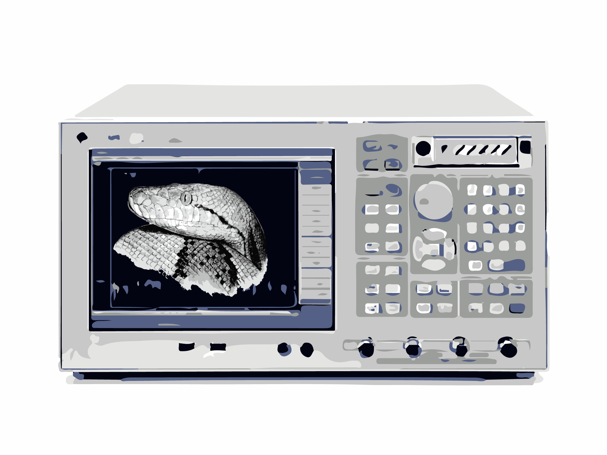

Python Repository
==================

This is the documentation of the the python libraries for devices, measurements
and data analysis of the AG Kirchmair at the IQOQI 
(https://iqoqi.at/en/group-page-kirchmair).

Current Main Developers
--------------------------
- Christian Schneider <c.schneider@uibk.ac.at>
- Oscar Gargiuolo <oscar.gargiulo@uibk.ac.at>

Please contact one of us, if you found some bugs, errors or have
recommendations. Thank you!

Contents
==========

.. toctree::
	:maxdepth: 3
    datamodule.rst
    circlefit.rst
    instruments.rst
    experiments.rst

Indices and tables
===================
* :ref:`genindex`
* :ref:`modindex`
* :ref:`search`

